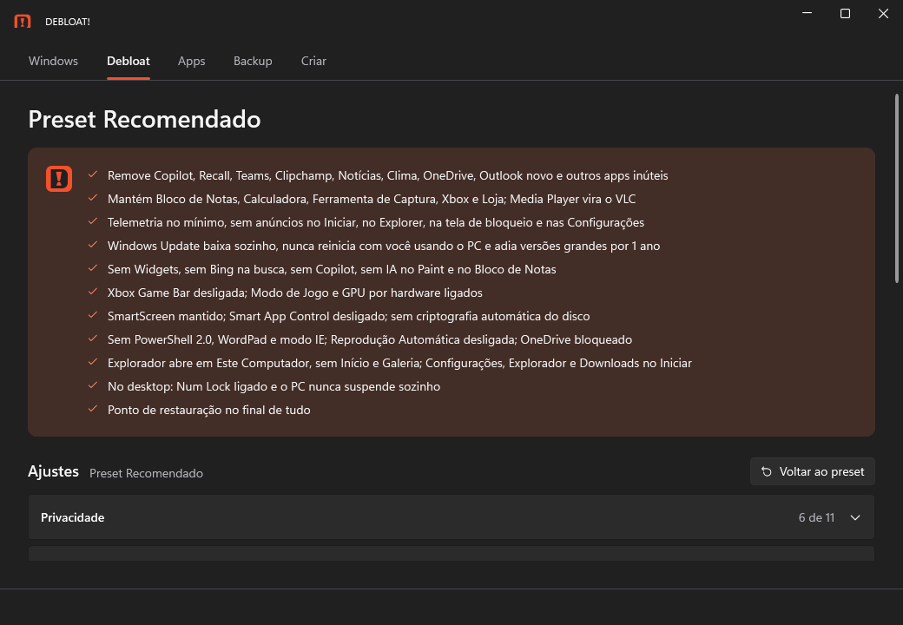

<p align="center">
  <picture>
    <source media="(prefers-color-scheme: dark)" srcset="docs/marca/svg/debloat-lockup-dark.svg">
    
  </picture>
</p>

<p align="center"><b>Seu Windows. Mais leve.</b></p>

Um programa que baixa o Windows 11 direto da Microsoft, monta a instalação sem o lixo de fábrica e
já deixa tudo pronto: seus apps, os pré-requisitos de jogos, o DNS e o backup dos seus saves. Um preset
pensado item por item, que dá para ajustar à vontade, ou usar sem mexer em nada.



## O que ele faz

- **Windows 11 oficial:** a versão pronta da Microsoft (ou, em teste, qualquer build via UUP dump), em português ou inglês.
- **Instalação quase sem perguntas:** pendrive ou ISO que só pergunta em qual disco instalar e faz o resto
  sozinho, com conta local sem senha — ou
  **sem pendrive**: o DEBLOAT prepara uma partição temporária no próprio disco, reinicia e reinstala, e depois
  devolve o espaço ao C:.
- **Debloat:** remove Copilot, Recall, Teams, Clipchamp, propaganda, telemetria e mais de 60 apps; mais de
  100 ajustes (privacidade, Explorer, Iniciar, Windows Update, jogos) com um preset recomendado.
- **Apps já instalados:** os instaladores vão dentro do pendrive/ISO; o primeiro login só instala (~7 min para o
  preset, em filas paralelas), com um aviso no canto que abre a lista dos apps — cada um com Abrir e, quando o
  Windows deixa, Fixar no Iniciar. 140+ apps, incluindo todos os runtimes de jogos (.NET, VC++, DirectX, XNA...).
- **Backup:** saves de jogos (Ludusavi e cracks), Wi-Fi, navegadores, ShareX, pastas que você escolher e os
  programas deste PC (pelo winget, ou levando a pasta dos portáteis), restaurados depois da instalação.
- **Drivers:** leva os de rede, disco e chipset do seu PC para a instalação; o de vídeo vem limpo pelo
  Windows Update, e o monitor fica na taxa de atualização máxima.

## Usar

Baixe o `DEBLOAT.exe` em [Releases](https://github.com/bernardomcr/DEBLOAT/releases) e abra como
administrador. O Windows SmartScreen avisa porque o programa não tem certificado de assinatura:
"Mais informações" → "Executar assim mesmo".

> Gravar o pendrive **apaga tudo nele**, e a instalação **apaga o disco do PC** onde ela rodar.
> Faça o backup antes.

## Compilar

```
git clone --recurse-submodules https://github.com/bernardomcr/DEBLOAT
dotnet test Debloat.slnx
dotnet run --project src/Debloat.App
```

Requer o .NET 10 SDK. Decisões e testes: [PLAN.md](PLAN.md).

## Créditos

- Gerador de `autounattend.xml`: [cschneegans/unattend-generator](https://github.com/cschneegans/unattend-generator) (MIT).
- Builds do Windows: [UUP dump](https://uupdump.net) e o conversor de abbodi1406.
- Configuração de referência: canal 1155 do ET.
- Ideias: Win11Debloat, Sophia Script, WinUtil, O&O ShutUp10++, Talon, Tiny11, Ninite, Ludusavi.
- Identidade visual: [docs/marca](docs/marca).
